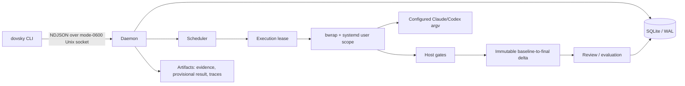
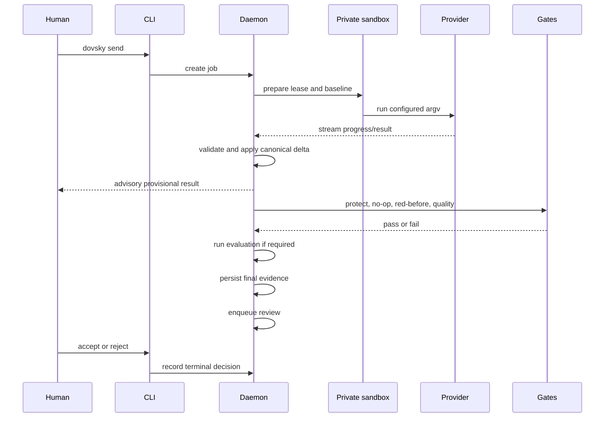

# Dovsky

Dovsky is a local-first control plane for human-led Claude Code and Codex CLI
work. One daemon owns provider processes and SQLite state; the `dovsky` CLI
submits work and makes jobs, evidence, failures, results, and handoffs
inspectable.

It is deliberately single-user and single-host. Runtime state and artifacts
stay outside Git under `${DOVSKY_HOME:-~/.dovsky}`. Configuration defaults to
`~/.config/dovsky/config.json`; keep configuration and any credential files
outside Git with operator-only permissions.

## Quick start

Requirements: Linux, Node.js 24 or newer, bubblewrap (`bwrap`), and a usable
systemd user manager. Providers must already be installed and authenticated for
the operator account.

Use an isolated checkout for builds; never build in the directory loaded by a
running service:

```sh
npm ci
npm run build
npm run typecheck
npm test
```

Create the operator configuration and protect it:

```sh
mkdir -p -m 700 ~/.config/dovsky
cp deploy/config.example.json ~/.config/dovsky/config.json
chmod 600 ~/.config/dovsky/config.json
# Replace /home/USER and the example project/provider settings.
```

The daemon selects configuration in this order: `--config PATH`,
`DOVSKY_CONFIG`, then `~/.config/dovsky/config.json`. State defaults to
`$DOVSKY_HOME` (`~/.dovsky`); `DOVSKY_SOCKET` can supply an omitted socket
path.

The supplied unit assumes the checkout is `~/dovsky` and
`~/.local/bin/nvm-default-node` exists. Meet those assumptions or copy the
template and change `WorkingDirectory`, `DOVSKY_HOME`, `DOVSKY_CONFIG`, and
`ExecStart` to absolute paths. Then install the CLI and unit and check them
locally:

```sh
mkdir -p ~/.local/bin ~/.config/systemd/user
ln -s "$PWD/bin/dovsky" ~/.local/bin/dovsky
install -m 0644 deploy/systemd/dovsky-daemon.service \
  ~/.config/systemd/user/dovsky-daemon.service
systemctl --user daemon-reload
systemctl --user enable --now dovsky-daemon.service
dovsky doctor
node deploy/verify.mjs
```

`dovsky doctor` exits non-zero when a configured prerequisite or provider is
unavailable. `deploy/verify.mjs` is a local verifier; it does not replace human
acceptance of change work.

## Architecture



The daemon is the sole SQLite writer and provider-process owner. The protocol
package contains versioned domain and wire contracts; the legacy-import package
reads the predecessor spool without launching providers.

Each job belongs to a room and contains turns and attempts. A fresh job uses
the configured workflow argv and a project worktree as its lock key. Follow-ups
resume the provider thread when provider/model/effort allow it; handoffs start a
new thread on the other provider.

## Configuration

Start with [`deploy/config.example.json`](deploy/config.example.json). A
configuration defines projects and worktree paths, read-only or change
workflows, provider argv and timeouts, host gates, review/evaluation policy,
routing policy, and the required bubblewrap sandbox, resource limits, network
policy, and allowed runtime/dependency/home paths.

Provider commands, project definitions, workflow quality commands, and sandbox
settings come only from local configuration. An operator may add bounded
per-job `--verify`, `--red-before`, `--protect`, and `--writable` gates through
the local CLI; a client cannot replace configured provider argv, project paths,
workflow quality commands, or sandbox policy over the daemon socket.
Keep the config directory at mode `0700` and the config file at mode `0600`.
See [`apps/daemon/README.md`](apps/daemon/README.md) for the config contract
and [`docs/runbook.md`](docs/runbook.md) for service operations.

## Safety guarantees

Provider attempts, evaluation commands, and gates run in a private per-job
bubblewrap view and a dedicated systemd user scope. The daemon fails closed if
bubblewrap, user namespaces, scope enrollment, resource limits, or scope
absence cannot be verified. Network access follows the resolved sandbox policy.

Before a detached command runs, Dovsky prepares an execution lease and records
process identity (PID/process group, Linux boot ID, and `/proc` start ticks).
After restart, a live or unverifiable process becomes `reconcile_required`; its
worktree and reservations are retained until identity-verified inspection.

Terminal states are immutable, cancellation is compare-and-set, mutations are
idempotent, and concurrent writes to one worktree are rejected. Change jobs
also protect package metadata, configured quality-command paths, caller-supplied
paths, and charter files. Application checks the canonical baseline identity
before applying only the captured delta.



These are application invariants, not a claim that fixture tests alone prove
kernel isolation. For a native host check, use:

```sh
DOVSKY_REQUIRE_SANDBOX=1 npm test -w @dovsky/daemon
```

## Daily workflow

Create work with `dovsky send`, inspect it with `dovsky status ROOM`,
`dovsky logs JOB`, and `dovsky wait JOB`, then use `dovsky followup ROOM` or
`dovsky retry JOB` as appropriate. `dovsky wait` proves execution, not
acceptance.

Change workflows default to medium evaluation. Provide criteria with a JSON
file such as `{"criteria":["An observable outcome to exercise"]}`:

```sh
dovsky send "Implement the change" --project dovsky --workflow change \
  --acceptance-file acceptance.json
dovsky wait JOB
# Exercise the acceptance criterion against the resulting tree.
dovsky accept JOB --criteria 0 --note "Verified the observable outcome"
dovsky acceptance-check JOB
```

Acceptance is a separate human decision. It checks the current tree, evidence,
and supersession; execution success, model review, and a routing grade alone do
not satisfy it. Use `--eval low --eval-reason "..."` for bounded work or
`--eval high` for baseline comparisons. Low evaluation can accept automatically
when its configured checks pass; medium and high retain the explicit human gate.

Successful non-read-only jobs can receive immutable review evidence and a
disjoint reviewer. A refutation may create a bounded correction when review
rounds are enabled. `dovsky review JOB` launches a new reviewer; use
`dovsky evidence JOB` or `dovsky status ROOM` to inspect stored evidence,
`dovsky followup ROOM --from-review` to act on the latest reasons, and
`--no-review` only where policy permits it.

## CLI command groups

The authoritative reference is generated by `dovsky --help`. The current groups
are:

- jobs: `send`, `status`, `wait`, `logs`, `followup`, `retry`, `cancel`,
  `grade`, `accept`, `reject`, `acceptance-check`, `review`;
- rooms and sessions: `ls`, `record`, `pin|unpin`, `archive|unarchive`,
  `sessions`, `inbox`;
- tasks and coordination: `tasks`, `task`, `control`;
- events: `events peek|take`, `events-ack`;
- routing and execution: `routing`, `execution show|reconcile`;
- artifacts and changes: `evidence`, `diff`, `pr`;
- GitHub/release administration; and
- exploration: `outline`.

Global options include `--socket`, `--key`, `--json`, `--project`, `--workflow`,
`--to`, `--tier`, `--model`, `--effort`, `--charter`, `--cwd`, `--verify`,
`--protect`, `--require-change`, `--red-before`, and `--writable`.

## Context and observability

### Bounded source outlines

`dovsky outline PATH [--cwd DIR --deadline MS]` produces a compact structural
summary for JavaScript, MJS/CJS/JSX, TypeScript, and TSX using Tree-sitter. It
reports imports/re-exports, declarations, immediate members, signatures,
adjacent documentation, byte/line spans, and parser problems without falling
back to an unsafe full-source response. Relative paths, symlinks, reads,
declarations, signatures, output bytes, and deadlines are bounded.

### Provisional results

While a job is running, Dovsky may expose one immutable
`provisional-result.v1.json` artifact containing sanitized provider text and
bounded changed-entry metadata. It is advisory: it cannot satisfy a gate,
acceptance, review, or publication requirement. The final result and host gates
remain authoritative; the artifact is hash-checked and remains unchanged after
database reopen.

### Setup telemetry

Execution setup events record only ordered, bounded phase durations:
`sandbox_availability`, `baseline_capture`, `dependency_materialization`,
`dependency_plan`, and `isolation_prepare`. They contain no execution context
or secret values. This telemetry is diagnostic baseline data, not evidence of a
performance improvement.

The publication-candidate outline benchmark reported **70.2045% median
compact-payload reduction** and **42.824 ms warm p95**. This is a bounded
benchmark claim for the outline payload, not a
general production latency or provider-cost claim. The fixed-fixture benchmark
record is retained with the release verification evidence.

## Operations and migration

Preview the read-only legacy import before applying it:

```sh
node packages/legacy-import/dist/cli.js --source ~/.agentbus/jobs
node packages/legacy-import/dist/cli.js --source ~/.agentbus/jobs --apply
```

The importer is content-addressed and safe to repeat; it does not launch
providers and never writes the source spool. For upgrades, use the staged,
isolated operator checklist in [`docs/runbook.md`](docs/runbook.md). Keep a verified
SQLite backup, retain the previous release for rollback, drain active work,
and inspect unresolved execution leases before changing authority.

`dovsky execution show JOB` inspects a lease. Use
`dovsky execution reconcile JOB --expect REVISION [--terminate]` only after
identity-verified inspection; termination does not release the reservation until
later inspection proves the process group absent.

## Troubleshooting

- `sandbox_unavailable` or `sandbox_apply`: check `bwrap`, user namespaces,
  systemd user scope availability, limits, and the native sandbox command above.
- `connect ENOENT` after restart: the daemon may not have bound its socket yet;
  rerun `dovsky doctor`.
- `provider_unavailable`: inspect the executable and PATH visible to the user
  service; the daemon records the failing provider and PATH.
- `reconcile_required`: inspect with `execution show`, then reconcile using the
  recorded revision and process identity. Do not clear uncertainty by changing
  the database manually.
- `acceptance-check` failure: the tree, evidence, or job lineage is stale; rerun
  the check against the exact intended release tree.
- `review_protocol`, `review_stale`, or `review_exhausted`: inspect reviewer
  output and stored evidence; use `evidence`, launch another `review`, or use
  `followup --from-review` as
  appropriate.
- `outline` rejects a path or reports a parser problem: use a regular file under
  `--cwd`, a supported extension, and a deadline/size within the documented
  bounds.

## Limitations

Dovsky does not provide autonomous agent loops, arbitrary remote command
execution, multi-user ACLs, dollar-cost accounting, or an external database.
The current product is daemon-only: there is no bridge HTTP API, browser trust
boundary, tunnel requirement, or live-provider call in ordinary CI. CI fixtures
may skip native sandbox probes unless `DOVSKY_REQUIRE_SANDBOX=1` is set.

Further design and verification detail is in
[`docs/architecture.md`](docs/architecture.md),
[`docs/sandbox.md`](docs/sandbox.md), [`docs/evaluation.md`](docs/evaluation.md),
and [`docs/runbook.md`](docs/runbook.md).
